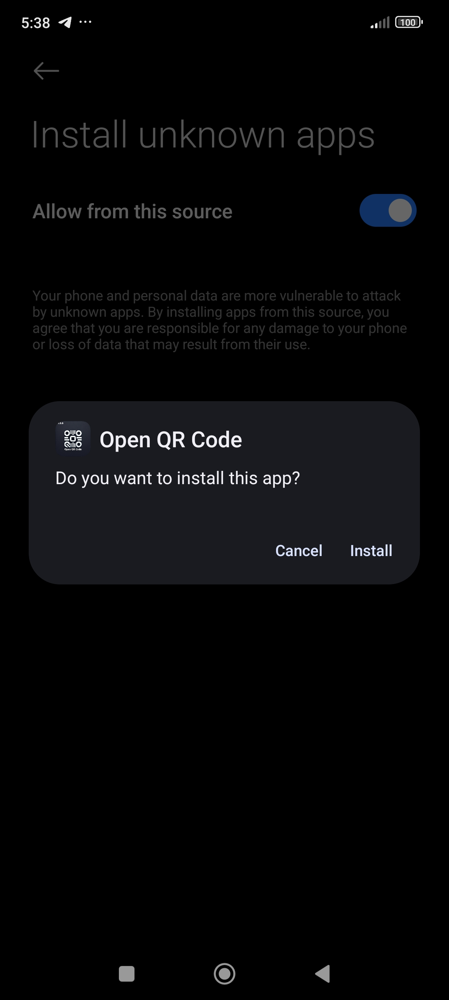

# Open QR Code
<div align="center">
  
</div>


## About
Open QR Code is an open-source cross-platform application developed using Flutter as main framework used to build the application, in common C, C++, Dart, Skia (a 2D rendering engine), and Impeller (the default rendering engine on iOS), Java, Kotlin. Open QR Code allows users to generate and scan QR codes effortlessly. The app is available on Android, Windows, and the Web. Users can generate QR codes from any text input, save them to their gallery, share them directly from the app, and scan QR codes to retrieve encoded information. Whether you're on Android, Windows, or the Web, you can create and share QR codes or scan them with a single click.

## Table of Contents

- [About](#about)
- [Features](#features)
- [Source Code Version 1.0.0](#source-code-version-100)
- [Platforms Tested](#platforms-tested)
- [Troubleshooting and Issues](#troubleshooting-and-issues)
  - [Troubleshooting While Building](#troubleshooting-while-building)
  - [Current Issues at v1.0.0](#current-issues-at-v100)
- [Demo Links and Downloads](#demo-links-and-downloads)
- [Screenshots](#screenshots)
  - [Screenshots Android](#screenshots-android)
  - [Screenshots Windows](#screenshots-windows)
- [Project Structure](#project-structure)
  - [Technology Stack](#technology-stack)
  - [Underlying Technologies](#underlying-technologies)
  - [MVVM Architecture](#mvvm-architecture)
  - [Why Use MVVM?](#why-use-mvvm)
- [Dependencies](#dependencies)
- [Getting Started](#getting-started)
  - [Prerequisites](#prerequisites)
- [Installation](#installation)
- [Usage](#usage)
  - [Generate QR Code](#generate-qr-code)
  - [Scan QR Code](#scan-qr-code)
- [Contributing](#contributing)
- [Acknowledgments](#acknowledgments)
- [License](#license)
- [Contact](#contact)


## Features

- **Generate QR Codes**: Convert any text input into a QR code.
- **Scan QR Codes**: Easily scan QR codes using your device's camera.
- **Save QR Codes**: Save the generated QR codes to your device's gallery.
- **Share QR Codes**: Share generated QR codes directly from the app.
- **Cross-Platform**: Available on Android, Web, and Windows.

## Source Code Version 1.0.0

- **Improved UI**: Enhanced user interface for a better user experience.
- **Cross-Platform Support**: Now available on Windows and Web.
- **MVVM Architecture**: Adopted MVVM architecture for better code organization and testability.
- **Bug Fixes**: Fixed issues related to QR code scanning on some Android devices.

## Platforms Tested

- [x] **Android**: Tested on Android 11 (Samsung Galaxy A32) and Redmi Note 13 Pro Plus 5G.
- [x] **Web**: Fully functional on major browsers like Chrome, Firefox, and Edge.
- [x] **Windows 11**: Tested on Windows 11 with a downloadable `.exe` file.
- [ ] **IOS**
- [ ] **Linux**
- [ ] **MacOS**


## Troubleshooting and Issues 

### Troubleshooting While Building
Thess Troubleshooting while you are building(Not our Build and Demo)

- QR Code not saving to gallery: Ensure that the app has the necessary permissions to access the storage.
- App crashes on startup: Check that all dependencies are installed correctly and that your environment is set up for Flutter development.

### Current Issues at v1.0.0
- On some mobile devices the icons spaces and not correctly displaying on some devices size.
- The QR Scanner is not working well using the web, only the QR Generator is working perfectly.
- The QR Scanner and Generator is not working well using the windows, it was working only on debug mode.


## Demo Links and Downloads

- **Web Demo**: [Open QR Code Web](https://openlabx.com/OpenQRCode.php)
- **Android APK**: [Download APK](https://github.com/openlab-x/OpenQRCode/raw/main/downlaod/Open%20QR%20Code-v1.0.0.apk)
- **Windows 11 EXE**: [Download EXE](https://github.com/openlab-x/OpenQRCode/raw/main/downlaod/OpenQRCode.zip)
- 


## Screenshots

### Screenshots Android

<p float="left">
  
  
  
  
  
  
</p>

<p float="left">
  
  
  
  
  
  
</p>

<p float="left">
  
  
  
  
  
  
</p>

<p float="left">
  
  
  
  
  
  
</p>

<p float="left">
  
</p>

### Screenshots Windows

<p float="left">
  
  
  
</p>

<p float="left">
  
  
  
</p>

<p float="left">
  
  
</p>


## Project Structure


### Technology Stack

Open QR Code leverages several technologies and follows the MVVM (Model-View-ViewModel) architecture to ensure clean separation of concerns, testability, and reusability. Below are some key technologies and concepts used in the project:

### Underlying Technologies 
  - **C/C++**: Core components and libraries may use C and C++ for performance-critical sections.
  - **Dart**: The primary programming language used for Flutter applications.
  - **Skia**: A 2D rendering engine used by Flutter to draw the UI.
  - **Impeller**: The default rendering engine on iOS, providing smooth and efficient rendering of graphics.
  - **Java**: Used primarily in Android development.
  - **Kotlin**: A modern programming language for Android development.
  - **HTML**: Used for the web version of the application.
  - **JSON**: For data interchange between the app and the backend or for configuration.


### MVVM Architecture

- **Model**: Represents the data and business logic of the application. In this project, the Model handles QR code data, including generation and scanning processes.
- **View**: The UI layer, which interacts with the user. In this project, views are represented by Flutter widgets, such as screens and buttons for generating and scanning QR codes.
- **ViewModel**: Acts as an intermediary between the Model and the View. It processes input from the View, updates the Model, and triggers UI updates.

### Why Use MVVM?
- **Separation of Concerns**: MVVM separates the data (Model), UI (View), and business logic (ViewModel), making the codebase easier to manage and extend.
- **Testability**: By decoupling the UI from the business logic, it's easier to write unit tests for the ViewModel and Model without relying on the actual UI.
- **Reusability**: Components such as ViewModels can be reused across different parts of the application, reducing code duplication.

## Dependencies

This project uses the following Flutter packages:

- **qr_flutter**: A Flutter widget that allows generating QR codes.
- **qr_code_scanner**: A Flutter plugin for scanning QR codes using the camera.
- **path_provider**: A Flutter plugin to access commonly used locations on the device's file system.
- **screenshot**: A Flutter plugin to capture widgets as images.
- **share_plus**: A Flutter plugin to share content from your Flutter app.
- **permission_handler**: A Flutter plugin to request and check permissions on iOS and Android.

## Getting Started

These instructions will help you set up the project on your local machine for development and testing purposes.

### Prerequisites

- [Flutter SDK](https://flutter.dev/docs/get-started/install)
- [Android Studio](https://developer.android.com/studio) or [Visual Studio Code](https://code.visualstudio.com/) with Flutter and Dart extensions.
- (Optional) [Xcode](https://developer.apple.com/xcode/) for iOS development.

## Installation

1. **Clone the repository**
   ```bash
   git clone https://github.com/yourusername/OpenQRCode.git
   cd open-qr-code

2. **Install dependencies**
   ```bash
   git flutter pub get
   cd open-qr-code

- **Android**
   ```bash
   flutter run -d android

 - **Webs**
   ```bash
   flutter run -d chrome

- **Windows**
   ```bash
   flutter run -d windows
   
## Usage

- ### **Generate QR Codes**
  1. Open the app.
  2. Enter the text you want to encode in the QR code.
  3. Click "Generate" to create the QR code.
  4. Use the "Save" button to save the QR code to your gallery.
  5. Use the "Share" button to share the QR code with others.

- ### **Scan QR Code**

  1. Open the app.
  2. Navigate to the "Scan" tab.
  3. Point your device's camera at a QR code.
  4. The app will automatically detect and display the encoded information.


## Contributing
 We welcome contributions! Here's how you can help:
  
  1. Give the project a STAR.
  2. Follow us on Github.
  3. Follow us on Social Media.
  4. Fork the repository.
  5. Create a new branch for your feature or bug fix.
  6. Make your changes.
  7. Submit a pull request.
  8. Please make sure to update tests as appropriate.


## Acknowledgments
- Flutter: The framework used to build the application.
- Baseflow: For the permission_handler and other plugins.
- All Contributors: Thanks to everyone who contributed to the project.


## License
This project is licensed under the [MIT license](LICENSE).

## Contact

In pursuit of innovation,  
**OpenLabX Team**

- **Website**: [https://openlabx.com](https://openlabx.com)
- **Email**: contact@openlabx.com

**Follow Us:**

<div align="center">
| <a href="https://www.instagram.com/openlabx_official/" target="_blank"><strong>Instagram</strong></a> |
<a href="https://x.com/openlabx" target="_blank"><strong>X (formerly Twitter)</strong></a> |
<a href="https://www.facebook.com/openlabx/" target="_blank"><strong>Facebook</strong></a> |
<a href="https://www.youtube.com/@OpenLabX" target="_blank"><strong>YouTube</strong></a> |
<a href="https://github.com/openlab-x" target="_blank"><strong>GitHub</strong></a> |
</div>
